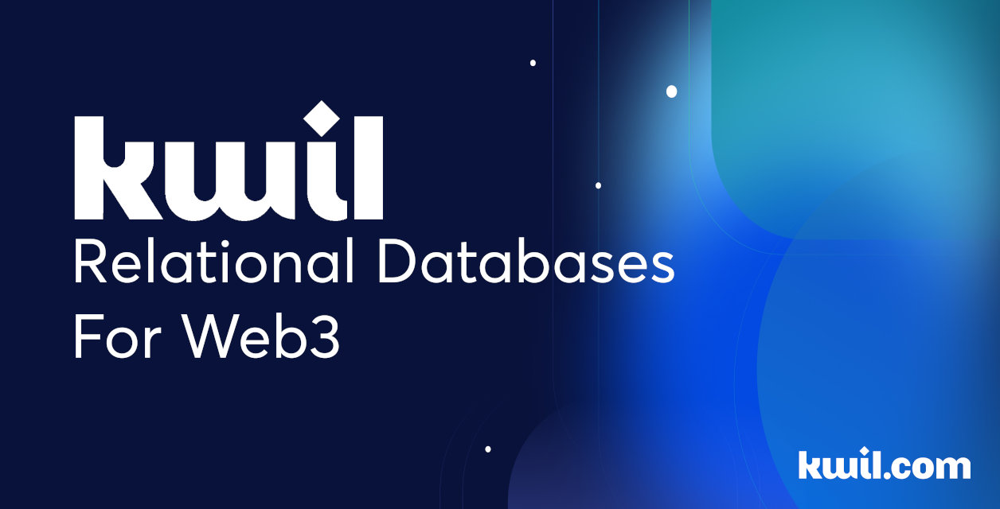

# Kwil

The database for Web3.




Kwil is the node software for Kwil Networks. Built with [PostgreSQL](https://www.postgresql.org/) and [CometBFT](https://github.com/cometbft/cometbft), Kwil enables byzantine fault tolerant networks to be built on top of relational databases.

## Overview

To learn more about high-level Kwil concepts, refer to the [Kwil documentation](https://docs.kwil.com/docs/concepts).

To test deploying and using a Kuneiform schema (Kwil's smart contract language) on the Kwil testnet, refer to the [Kwil testnet tutorial](https://docs.kwil.com/docs/getting-started/create-a-database).

For more information on kwil-db, check out the [Kwil node documentation](https://docs.kwil.com/docs/node/quickstart).

## Quickstart

### Build Instructions

#### Prerequisites

To build Kwil, you will need to install:

1. [Go](https://golang.org/doc/install) 1.21 or 1.22
2. (optional) [Protocol Buffers](https://protobuf.dev/downloads/), with the `protoc` executable binary on your `PATH`.
3. (optional) [Taskfile](https://taskfile.dev/installation)
4. (optional) Protocol buffers go plugins and other command line tools. The `tool` task will install the required versions of the tools into your `GOPATH`, so be sure to include `GOPATH/bin` on your `PATH`.

    ```shell
    task tools
    ```

Only Go is required to build directly from the `cmd/kwild` folder or via `go install`, although developers may require the other tools.

To *run* Kwil, PostgreSQL is also required. See the [documentation](<https://docs.kwil.com/docs/daemon/installation>) for more information.

#### Build

The `build` [task](https://taskfile.dev/) will compile `kwild`, `kwil-cli`, and `kwil-admin` binaries. They will be generated in `.build/`:

```shell
task build
```

You may also build the individual applications manually:

```shell
cd cmd/kwild
go build
```

Or without even cloning the source repository:

```shell
go install github.com/kwilteam/kwil-db/cmd/kwild@v0.7.0
```

Just replace `v0.7.0` with the desired version or `latest`.

### Running `kwild`

Running `kwild` requires a PostgreSQL host running. Since the default
configuration of most PostgreSQL packages requires changes for `kwild`, the
easiest is to run our pre-configured Docker image:

```shell
docker run -p 5432:5432 -v kwil-pg-demo:/var/lib/postgresql/data \
    --shm-size 256m -e "POSTGRES_HOST_AUTH_METHOD=trust" \
    --name kwil-pg-demo kwildb/postgres:latest
```

The first time this is run, it will pull the `kwildb/postgres` image from Docker
Hub and create a new persistent Docker volume named `kwil-pg-demo`. NOTE: This
command requires no authentication with `postgres`, and should not be used in
production.

`task pg` may be used to run the above command.

You can then start a single node network using the `kwild` binary built in the previous section:

```shell
# Use the full path to kwild if it is not on your PATH.
kwild --autogen
```

With the `--autogen` flag, the node automatically creates a new random network
and validator key, and the node will begin producing blocks.

For more information on running nodes, and how to run a multi-node network, refer to the Kwil [documentation](https://docs.kwil.com/docs/node/quickstart).

### Resetting node data

By default, `kwild` stores all data in `~/.kwild`. To reset the data on a deployment, remove the data directory while the node is stopped:

```shell
rm -r ~/.kwild
```

Then delete the PostgreSQL database. If using the Docker image or service, delete the container and it's volume:

```shell
docker container rm -f kwil-pg-demo
docker volume rm -f kwil-pg-demo
```

`task pg:clean` may be used to run the above commands.

If using a system install of `postgres`, recreate the database with `psql`:

```shell
psql -U postgres -h 127.0.0.1 -d postgres \
    -c "DROP DATABASE IF EXISTS kwild" \
    -c "CREATE DATABASE kwild OWNER kwild"
```

### Unified `kwild` + `postgres` Quickstart Docker Service

For development purposes, the `deployments/compose/kwil` folder contains a
Docker Compose service definition that starts both `kwild` and `postgres`,
configured so that they will work together out-of-the-box with no additional
configuration changes. Start it by running the following from the
`deployments/compose/kwil` folder in the repository:

```sh
cd deployments/compose/kwil
docker compose up -d
```

With the `-d` option, the service(s) will be started as background processes. To
stop them or view logs, use the `docker container` commands or the Docker
Desktop dashboard.

On start, this service definition will create a `testnode` folder in the same
location as the `docker-compose.yml` file, and a persistent Docker volume called
`kwil_pgkwil` for the `postgres` database cluster files.

This also runs with the `--autogen` flag, creating a new randomly generated
chain, and is not intended for production use. However, the service definition
may be used as a basis for a customized deployment.

## Extensions

Kwil offers an extension system that allows you to extend the functionality of your network (e.g. building network oracles, customizing authentication, running deterministic compute, etc.). To learn more about the types of extensions and how to build them, refer to the extensions directory [README](extensions/README.md).

## Contributing

We welcome contributions to kwil-db. To contribute, please read our [contributing guidelines](CONTRIBUTING.md).

## License

The kwil-db repository (i.e. everything outside of the `core` directory) is licensed under the Apache License, Version 2.0. See [LICENSE](LICENSE) for more details.

The kwil Go SDK (i.e. everything inside of the `core` directory) is licensed under the MIT License. See [core/LICENSE.md](core/LICENSE.md) for more details.
