# Kuneiform SQL

Kuneiform SQL is a subset of SQL(SQLite), some features are eliminated to:
* keep it simple while still useful
* keep it deterministic
* restrict resource usage

## Language

### select-stmt
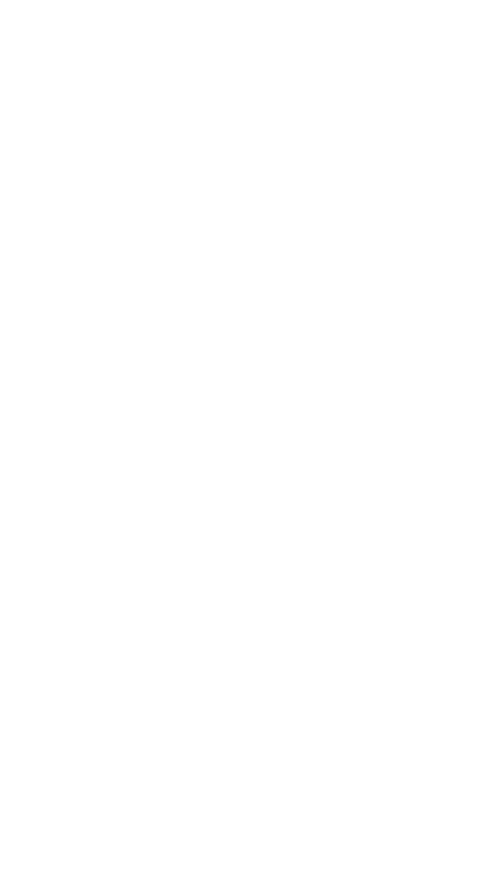

### insert-stmt
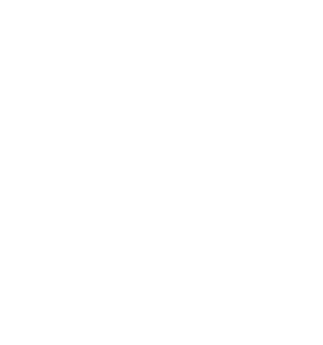

### upsert-clause
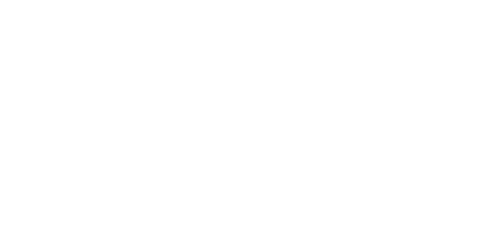

### common-table-expression
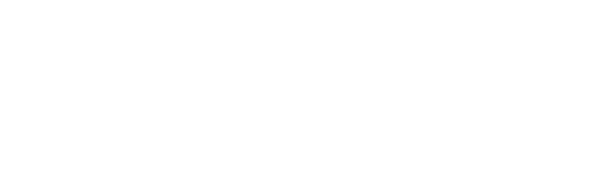

### compound-operator
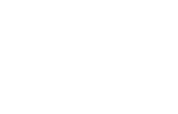

### expr
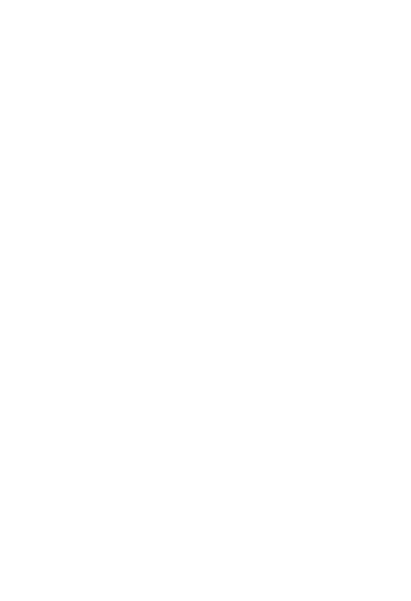

### filter-clause
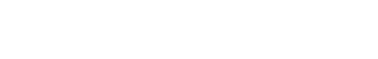

### join-clause
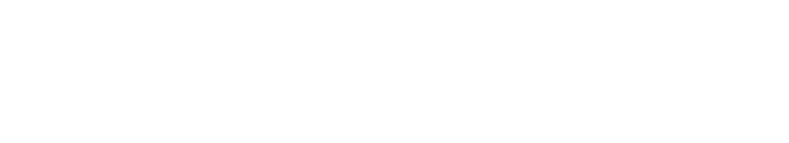

### join-constraint

### join-operator
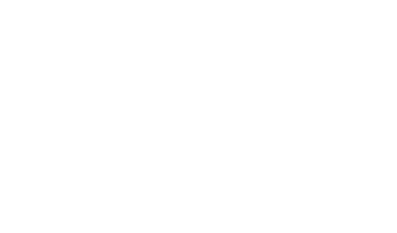

### literal-value
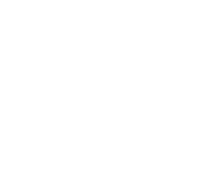

### result-column
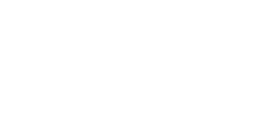

### column-name-list
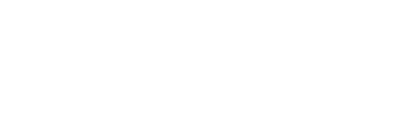

### returning-clause
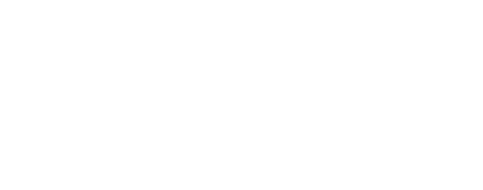

### table-or-subquery
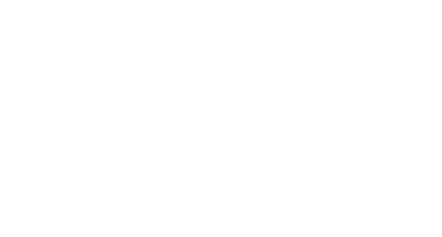
